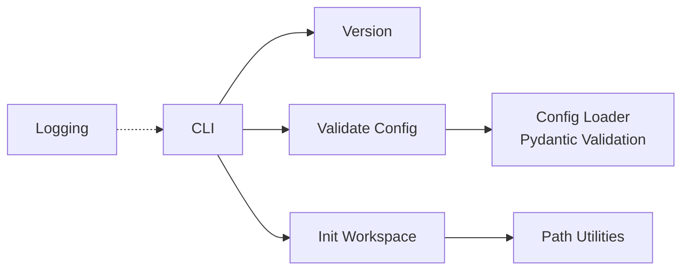
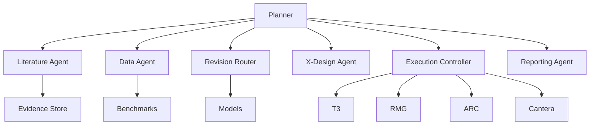

# Carmel

[](https://github.com/DanaResearchGroup/Carmel/actions/workflows/ci.yml)
[](https://codecov.io/gh/DanaResearchGroup/Carmel)
[](https://github.com/DanaResearchGroup/Carmel)
[](https://www.python.org/downloads/)
[](https://github.com/astral-sh/ruff)
[](https://opensource.org/licenses/MIT)

```
        ██████╗ █████╗ ██████╗ ███╗   ███╗███████╗██╗
        ██╔════╝██╔══██╗██╔══██╗████╗ ████║██╔════╝██║
        ██║     ███████║██████╔╝██╔████╔██║█████╗  ██║
        ██║     ██╔══██║██╔══██╗██║╚██╔╝██║██╔══╝  ██║
        ╚██████╗██║  ██║██║  ██║██║ ╚═╝ ██║███████╗███████╗
         ╚═════╝╚═╝  ╚═╝╚═╝  ╚═╝╚═╝     ╚═╝╚══════╝╚══════╝
             Agentic Predictive Chemical Kinetics Engine
```

**Closed-loop campaign manager for predictive chemical kinetics.**

Carmel automates the iterative cycle of building, validating, refining, validating, and revising predictive chemical kinetic models. It orchestrates simulation tools, literature evidence, experiment design, and model revision through a bounded ensemble of specialized agents with full provenance tracking and human-in-the-loop governance.

## Installation

### Prerequisites

- Python 3.12+
- [Conda](https://docs.conda.io/en/latest/)

### Setup

```bash
# Clone the repository
git clone https://github.com/DanaResearchGroup/Carmel.git
cd Carmel

# Create and activate the conda environment
conda env create -f environment.yml
conda activate crml_env

# Install Carmel in editable mode with dev dependencies
make install
```

## Usage

```bash
# Show version
carmel version

# Validate a configuration file
carmel validate-config config.yaml

# Initialize a new workspace
carmel init-workspace my-campaign
```

### Configuration

Carmel workspaces are configured via YAML:

```yaml
workspace_name: ethanol-combustion
workspace_root: ./workspaces/ethanol
logging_level: INFO
budgets:
  cpu_hours: 500.0
  experiment_budget: 10000.0
metadata:
  author: researcher
  description: Ethanol oxidation mechanism development
```

### Workspace Structure

`carmel init-workspace` creates the standard directory scaffold:

```
my-campaign/
├── benchmarks/    # Curated benchmark bundles and credence records
├── evidence/      # Literature memos, extracted records, source links
├── models/        # Generated mechanism versions and diffs
├── provenance/    # Hashes, versions, tool settings, costs
├── reports/       # Final and intermediate reports
└── runs/          # Executed tool runs and statuses
```

## Development

```bash
make test        # Run tests with coverage
make lint        # Lint and format check
make typecheck   # Type check with mypy
make check       # All of the above
make format      # Auto-fix formatting
make install     # Editable install with dev deps
```

To run a specific test:

```bash
pytest tests/test_config.py
pytest tests/test_config.py::TestCarmelConfig::test_minimal_config
```

## Architecture

### Current (Phase 0 — Foundations)



| Module               | Purpose                                    |
|----------------------|--------------------------------------------|
| `carmel/config.py`   | Configuration loading and pydantic validation |
| `carmel/paths.py`    | Path utilities and workspace initialization |
| `carmel/logger.py`   | Centralized logging configuration           |
| `Carmel.py`          | CLI entrypoint (repo root)                 |

### Future (Phase 1+)

Carmel will grow into a bounded ensemble of specialized agents:



All agents operate under strict governance: deterministic code first, typed schemas, bounded autonomy, full provenance, and human-in-the-loop gates for expensive or high-stakes actions.

## License

MIT — see [LICENSE](LICENSE).
